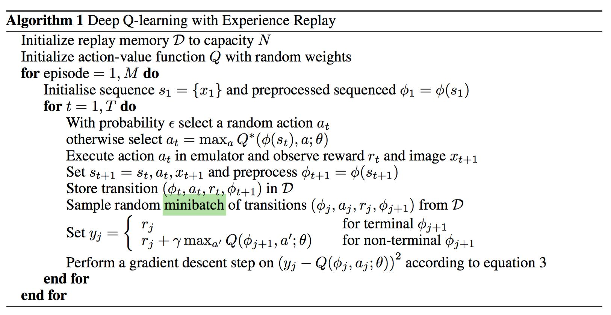
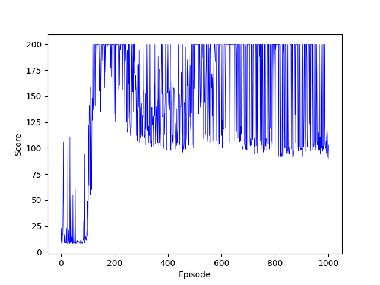
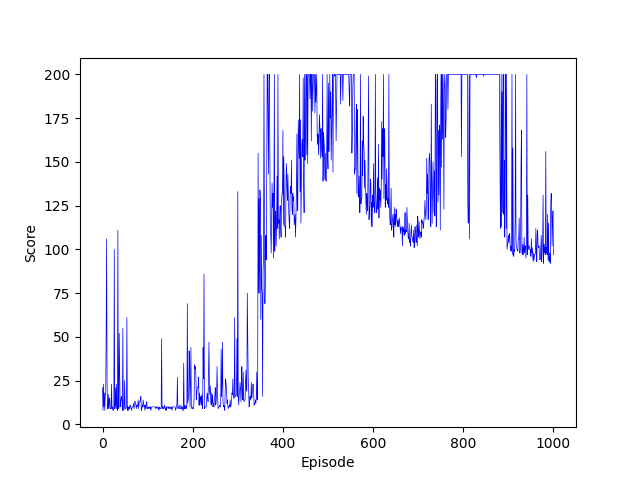
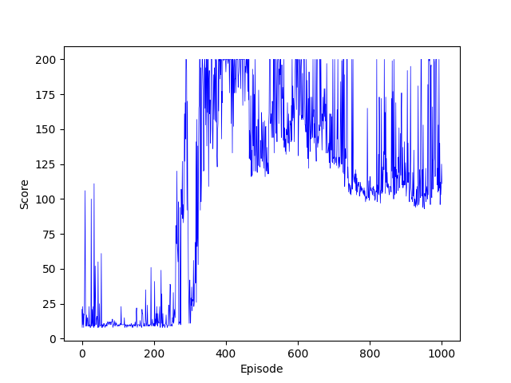

<!-- ---
export_on_save:
 html: false
--- -->

DQN及相關優化算法
---

傳統MDP需要紀錄每個state的轉移，但可想而知，在真實的世界裡，state的種類不計其數，難以有足夠的空間儲存，更不會有時間讓MDP的模型迭代收斂，在這樣的限制下DQN應運而生。

Deep Q-learning（DQN）將深度學習與MDP結合，不再記錄每個state的轉移，而是訓練一個神經網絡來評估各種state下action的價值，這種方法顯然解決了儲存空間過大的問題，但於此同時，透過神經網路得來的估值終究不如紀錄的精準，也未必能夠收斂，因此產生了一系列模型來解決這樣的問題。

在此主要紀錄算法的優缺點與一些優化的手法，不會對MDP的原理一類細節做過多解釋。

**DQN**
- 最基礎的DQN，用一個神經網路來評估各個state下action的價值
- 算法流程：

  
  
- Replay experience：
  - 在DQN中，做完每個action，會將收到的回饋存入記憶體中，再從記憶體裡隨機抽取一些轉移紀錄訓練神經網路，其目的在於不要忘記過去的狀況
  - 如果每次都拿最新的回饋訓練，神經網路只會fit最近一段時間的數據
- Batch size：
  - 每次抽取部分的資料，是因為拿全部的資料訓練，會需要太長的時間，而基於批梯度下降法的邏輯，選取一定大小的資料訓練，可以保證相似的梯度方向
  - batch越大，梯度方向越準確，訓練的震盪也越小
- 缺點：
  - 學習表現不穩定，起伏大
  - 用神經網路預估的結果優化自身，相關性太強，不容易收斂

**Nature DQN**
- 基於DQN的改進，有兩個相同架構的神經網路，不再使用身經網路的預測值來優化自身，而是使用另一個target網路來預估，每隔一段時間將被訓練的神經網路參數複製給target神經網路，以此做階段性的學習
- 缺點：
  - 在學習時，next state的預估都採用最大值，使得Q值高估，有更大的bias

**Double DQN**
- 基於Nature DQN的改進，一樣有兩個相同架構的神經網路，在使用target網路的預估值時，不再直接取最大的Q值，而是按訓練的神經網路更偏好哪個action（評分更高）選取Q值

**優化與實作細節**
- Reward：
  - 在真實環境中，Reward時常是不顯著的，舉例而言，在CartPole的遊戲中，只要這一個action沒有導致遊戲結束Reward就是1，反之是0，這樣的數據很難幫助模型判斷動作的好壞
  - 我實作時不採用原本的Reward，而是重新設計Reward function，其中主要考慮遊戲是否結束、車子離中心距離，以及木棒傾斜角度
  - 另一個問題是Reward的分佈並不平均，使遊戲繼續跟使遊戲結束的轉移的比例相當懸殊，這會影響抽取batch學習的bias，若是連續抽取的資料都沒有會使遊戲結束的數據，會導致不好的訓練結果
  - 我將記憶體分成兩個相同大小的部分，分別紀錄遊戲結束跟遊戲繼續的轉移，抽取batch時，各抽取一半，保證訓練數據的平衡

**訓練表現紀錄與Code**
- DQN
  - [Code](./dqn/dqn_cartpole.py)

  

- Nature DQN
  - [Code](./nature_dqn/nature_dqn_cartpole.py)

  

- Doudle DQN
  - [Code](./ddqn/ddqn_cartpole.py)
  
  

**可執行run.py進行demo**